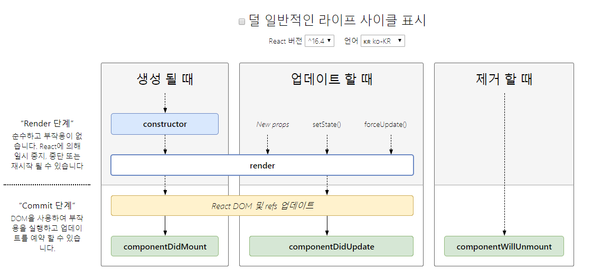

# react-study
react study


```
https://dev.to/vish448/create-react-project-without-create-react-app-3goh

npx create-react-app my-app
cd my-app
npm start

위 명령어로 react 프로젝트를 쉽게 구성을 할 수 있으나,
연습겸 직접 구성을 해보기로한다.

1. npm init
2. npm install --save react react-dom
3. .gitignore file make
4. mkdir public
5. mkdir src
6. make public/index.html
7. make src/server.js
8. make src/index.css  


9.
npm install --save-dev 
@babel/core @babel/preset-env @babel/preset-react 
webpack webpack-cli webpack-dev-server 
babel-loader css-loader style-loader node-sass sass-loader
html-webpack-plugin

10. koa koa-static koa-logger koa-router koa-static pm2 cross-env

```

#### React Router 구성

```
- react router 구성 
1. npm i --save react-router-dom

라우팅이란?
우리의 요청(Request)를 URI에 맞게 연결해주는 것.
react-router 는 주소값(URI)에 변경에 따라 페이지 혹은 컴포넌트의 전환을 제공하기 위한 라이브러리.

react-router 라이브러리는 코어 라이브러리구요.
react-router-dom 은 react-router 라이브러리를 랩핑(wrapper)한 라이브러리 입니다.

이러한 라우터 컴포넌트들을 제공합니다.

<BrowserRouter> : HTML5 history API 를 사용하여 동작(pushState, replaceState, popState)
<HashRouter> : # -> Hash 값을 사용하여 동작(window.location.hash)
<MemoryRouter> : 메모리에 기록하여 동작(주소표시줄을 읽거나 쓰지 않음. RN같은 환경에서 유용)


1) <BrowserRouter> 적용

import React from 'react';
import ReactDOM from 'react-dom';

// router
import {BrowserRouter} from 'react-router-dom';

import './index.scss';

// components
import App from './components/App.js';

ReactDOM.render(
    <BrowserRouter>
        <App/>
    </BrowserRouter>,
    document.getElementById('root')
);

webpack 개발서버모드에서 정상작동을 위해서, 
historyApiFallback: true 
위와 같은 설정을 추가해준다.
historyApiFallback ? 
HTML5의 History API를 사용하는 경우에 설정해놓은 url 이외의 url 경로로 접근했을때 404 responses를 받게 되는데 이때도 index.html을 서빙할지 결정하는 옵션

import {Switch, Route, Link} from 'react-router-dom';
라우터를 사용하가 하는 컴포넌트에서 위와 같이 이제 사용을 해주면 됩니다.

<Route exact path='/' component={Main} />
요청(url)이 들어왔을 때 그 요청에 맞는 컴포넌트를 보여주는 역할을 하는 것이 Route(라우트!)입니다.
exact prop 을 지정해주면, path가 정확히 일치할 때만 보여지게 해준다.

<Link to='/'>이동</Link>
컴포넌트(또는 페이지)를 이동할 때 사용합니다.(a 태그 역할입니다.)

<Switch></Switch>
라우터들을 그룹핑 합니다. 
가장 먼저 path에 매치되는 Route에 연결

```

#### React Hooks

```
- Hooks 는 16.8 버전부터 도입되었다.
- Hooks 를 이용하면, class 작성이 필요없이 상태값과 기존에 제공하는 기능들을 사용할 수 있다.
- 함수에서 state와 react의 다양한 기능들을 사용하기 위해 나온 기술이다.

```


출처 : https://ko.reactjs.org/docs/react-component.html
```
1. 초기화
constructor()
static getDerivedStateFromProps()
render()
componentDidMount()

2. 업데이트
static getDerivedStateFromProps()
shouldComponentUpdate()
render()
getSnapshotBeforeUpdate()
componentDidUpdate()

3. ㅃㅇ (컴포너틑가 DOM에서 제거될 때 호출)
componentWillUnmount()


getDerivedStateFromProps(props, state)는 최초 마운트 시와 갱신 시 모두에서 render() 메서드를 호출하기 직전에 호출

```


